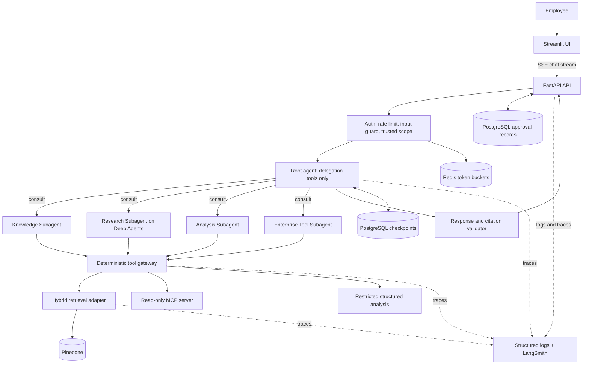

# Initial Architecture

## System context

## Trust boundaries and data flow

1. FastAPI authenticates a bearer token and constructs an immutable trusted identity.
2. The token bucket and input guard run before any model or retrieval call.
3. The API loads only a conversation owned by that identity.
4. The root chooses which specialists to consult and each specialist chooses its own tool calls, but
   neither can select permissions, namespace, access filters, timeouts, or execution budgets.
5. Retrieval combines dense and sparse candidates only after server-derived filters are applied.
6. Retrieved text is evidence—not instructions—and passes content checks before model use.
7. Every tool request, retrieval included, passes through the central gateway for allowlist, RBAC,
   schema, timeout, budget, and audit checks, with the trusted context injected by the runtime
   rather than supplied by the model.
8. The output validator resolves every citation against the request's evidence ledger. Invalid
   citations are repaired once; otherwise the response becomes `insufficient_evidence`.
9. SSE exposes safe activity summaries and answer tokens, never hidden chain-of-thought.

## Agent boundary

The root agent's whole tool surface is delegation, so it holds no capability of its own: it selects
specialists, composes their replies, and writes the answer, but cannot reach a document, a record, a
file, or a shell. Knowledge, Research, Analysis, and Enterprise Tool specialists are autonomous
tool-calling loops that isolate context and return typed outcomes. Complex research plans with
`write_todos`, searches in parallel, and re-plans against the evidence it has gathered. The reported
route, status, evidence, and citations are rebuilt from the delegations that actually ran, so the
answer's provenance describes observed work rather than model claims. Deterministic services remain
the sole authority for identity, policy, retrieval scope, memory ownership, budgets, validation,
retries, and cancellation.

## Runtime ownership

| State or concern | Owner |
|---|---|
| Identity and role mapping | authentication service |
| Tool and document permissions | authorization policy service |
| Conversation checkpoints | PostgreSQL |
| Rate-limit buckets | Redis |
| Dense vectors and metadata | Pinecone, or the deterministic in-memory adapter locally |
| Sparse index | retrieval adapter-managed BM25 index |
| Evidence ledger | per-request application state |
| Agent execution state | LangGraph checkpoint/state |
| Approval records | PostgreSQL in the Compose profile |
| Logs and traces | structured logger and LangSmith |

## Failure containment

External calls have explicit timeouts and bounded retries. One failed tool call is returned to the
specialist as a degraded result and does not cancel its parallel siblings; an authorization denial
ends the turn instead. Sparse failure permits a marked dense-only result; retrieval or model failure
never permits a fabricated answer. Client disconnect and overall deadline cancel outstanding graph
and tool work.
