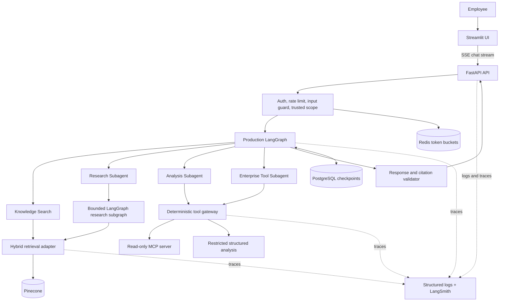

# Initial Architecture

## System context

## Trust boundaries and data flow

1. FastAPI authenticates a bearer token and constructs an immutable trusted identity.
2. The token bucket and input guard run before any model or retrieval call.
3. The API loads only a conversation owned by that identity.
4. The root agent chooses a direct or delegated path, but cannot select permissions, namespace,
   access filters, timeouts, or execution budgets.
5. Retrieval combines dense and sparse candidates only after server-derived filters are applied.
6. Retrieved text is evidence—not instructions—and passes content checks before model use.
7. Every non-retrieval tool request passes through the central gateway for allowlist, RBAC,
   schema, timeout, budget, and audit checks.
8. The output validator resolves every citation against the request's evidence ledger. Invalid
   citations are repaired once; otherwise the response becomes `insufficient_evidence`.
9. SSE exposes safe activity summaries and answer tokens, never hidden chain-of-thought.

## Agent boundary

The production LangGraph owns intent routing, delegation, and draft synthesis. Static Research,
Analysis, and Enterprise Tool specialists isolate context and return typed outputs.
Complex research uses an explicit plan → retrieve → bounded fan-out → reduce → coverage loop.
Deterministic services remain the sole authority for identity, policy, retrieval scope, memory
ownership, budgets, validation, retries, and cancellation.

## Runtime ownership

| State or concern | Owner |
|---|---|
| Identity and role mapping | authentication service |
| Tool and document permissions | authorization policy service |
| Conversation checkpoints | PostgreSQL |
| Rate-limit buckets | Redis |
| Dense vectors and metadata | Pinecone |
| Sparse index | retrieval adapter-managed BM25 index |
| Evidence ledger | per-request application state |
| Agent execution state | LangGraph checkpoint/state |
| Logs and traces | structured logger and LangSmith |

## Failure containment

External calls have explicit timeouts and bounded retries. One failed research worker does not
cancel successful siblings. Sparse failure permits a marked dense-only result; retrieval or
model failure never permits a fabricated answer. Client disconnect and overall deadline cancel
outstanding graph and tool work.
